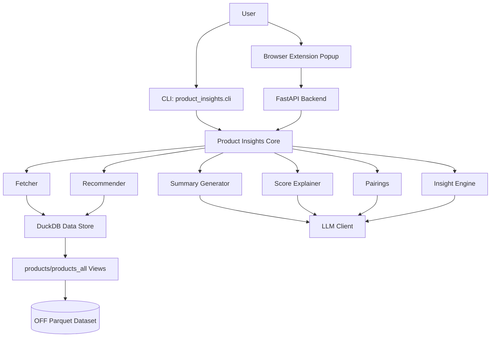
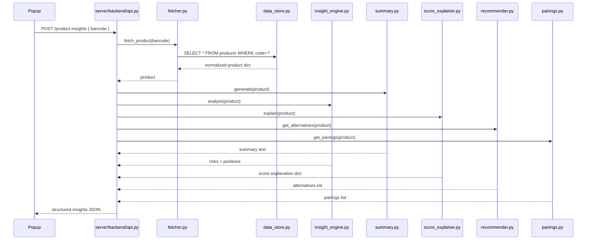
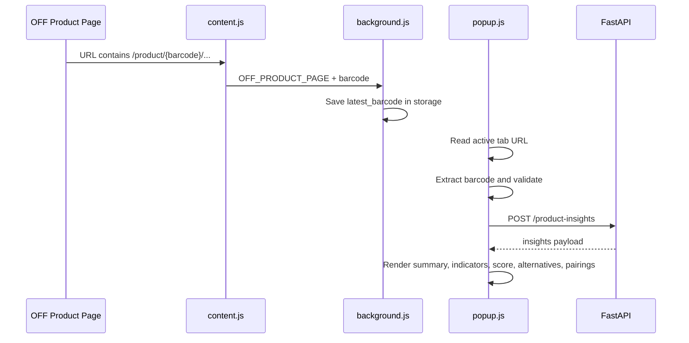

# AI Product Insights Prototype

## 1. Prototype Summary

This repository implements an end-to-end prototype that delivers health and nutrition insights for Open Food Facts (OFF) products.

Input:
- A barcode or OFF product URL.

Output:
- Product summary (LLM-first).
- Risk and positive health indicators.
- NutriScore and NOVA explanations.
- Better alternatives from the OFF Canada catalog.
- Suggested food pairings.

The solution supports two user experiences:
- CLI workflow for development and testing.
- Browser extension workflow for real-time insights from OFF product pages.

## 2. What We Built (Full Process)

### Phase 1: Core Analysis Engine
- Implemented reusable modules under [server/product_insights/](server/product_insights/):
  - [server/product_insights/fetcher.py](server/product_insights/fetcher.py): resolves barcode or OFF URL and fetches the matching product.
  - [server/product_insights/insight_engine.py](server/product_insights/insight_engine.py): computes rule-based risk and positive indicators with optional LLM contextual additions.
  - [server/product_insights/summary.py](server/product_insights/summary.py): produces LLM-first summary with optional template fallback.
  - [server/product_insights/score_explainer.py](server/product_insights/score_explainer.py): explains NutriScore, NOVA, and nutrient density.
  - [server/product_insights/recommender.py](server/product_insights/recommender.py): category-aware alternatives with weighted nutrition ranking.
  - [server/product_insights/pairings.py](server/product_insights/pairings.py): LLM-first pairings with category realism post-processing.

### Phase 2: Data Layer Migration to DuckDB
- Replaced direct OFF HTTP-based lookup/recommendation paths with a DuckDB-backed local data layer.
- Added normalized DuckDB view generation in [server/product_insights/data_store.py](server/product_insights/data_store.py):
  - `products_all` view for all records.
  - `products` view filtered to Canada (`en:canada`).
- Added robust dataset path resolution order:
  1. `OFF_PARQUET_PATH` env override.
  2. `off_dev.parquet` (repo root).
  3. `server/product_insights/off_dev.parquet`.
  4. `server/product_insights/food.parquet`.
- Added URL normalization to Canada OFF instance via [server/product_insights/off_config.py](server/product_insights/off_config.py).

### Phase 3: LLM Integration
- Added provider abstraction in [server/product_insights/llm_client.py](server/product_insights/llm_client.py).
- Added environment-driven LLM config in [server/product_insights/llm_config.py](server/product_insights/llm_config.py).
- Supported providers:
  - Groq (default): `llama-3.3-70b-versatile`
  - Gemini (optional)
- Added feature flags:
  - `USE_LLM_PAIRINGS=true` enables LLM capabilities.
  - `LLM_FALLBACK_TO_RULES=false` keeps strict LLM-first behavior unless enabled.

### Phase 4: API Layer
- Built FastAPI wrapper in [server/backend/api.py](server/backend/api.py):
  - `GET /health`
  - `POST /product-insights`
- Added schema models in [server/backend/models.py](server/backend/models.py) for request/response structure.
- Enabled CORS for extension integration.

### Phase 5: Browser Extension Integration
- Added extension runtime in [client/extension/](client/extension/):
  - [client/extension/content/content.js](client/extension/content/content.js): extracts barcode from OFF product page URL.
  - [client/extension/background/background.js](client/extension/background/background.js): stores latest barcode in `chrome.storage.local`.
  - [client/extension/popup/popup.js](client/extension/popup/popup.js): validates active tab, calls backend API, renders UI states and insights.
  - [client/extension/manifest.json](client/extension/manifest.json): MV3 permissions and host access.

### Phase 6: Quality and Validation
- Added unit tests in [server/tests/test_product_insights.py](server/tests/test_product_insights.py):
  - helper normalization/parsing.
  - rule engine checks.
  - summary/score explanations.
  - pairings behavior.
  - URL normalization and data transformation behavior.
- Added setup docs in:
  - [README.md](README.md)
  - [server/backend/README.md](server/backend/README.md)
  - [client/extension/README.md](client/extension/README.md)
  - [LLM_SETUP.md](LLM_SETUP.md)

## 3. Current System Architecture

### 3.1 High-Level Component View



### 3.2 Backend Request Flow



### 3.3 Browser Extension Flow



## 4. Data Architecture

### 4.1 Data Source
- OFF parquet dataset, typically:
  - `server/product_insights/food.parquet` (full)
  - `server/product_insights/off_dev.parquet` (Canada-focused development subset)

### 4.2 Dataset Preparation Pipeline
- Script: [scripts/create_canada_dev_dataset.py](scripts/create_canada_dev_dataset.py)
- Behavior:
  - Reads full OFF parquet.
  - Applies normalized select via `build_products_select_sql`.
  - Writes Canada-only dev subset (`off_dev.parquet`) with default limit 50,000 rows.

### 4.3 Query Strategy
- Fetch path:
  - `SELECT * FROM products WHERE code = ? LIMIT 1`
- Recommendation path:
  - category-tag matching (`list_has_any`) across `products` and `products_all`.
  - nutrition-aware ranking and confidence scoring.

## 5. Recommendation Logic (Prototype Behavior)

In [server/product_insights/recommender.py](server/product_insights/recommender.py), alternatives are generated with these rules:
- Uses most specific parent categories from OFF `categories_tags`.
- Fetches candidate alternatives from Canada-first view (`products`), then broader fallback (`products_all`).
- Computes weighted score over normalized nutrition deltas:
  - sugars: 0.30 (lower is better)
  - fat: 0.20 (lower is better)
  - salt: 0.15 (lower is better)
  - proteins: 0.20 (higher is better)
  - fiber: 0.15 (higher is better)
- Adds NutriScore and NOVA improvements as supplemental scoring signals.
- Produces human-readable reason text plus confidence and OFF URL.

## 6. LLM Design

### 6.1 LLM-Touched Components
- [server/product_insights/summary.py](server/product_insights/summary.py): concise health-oriented summary.
- [server/product_insights/score_explainer.py](server/product_insights/score_explainer.py): NutriScore and NOVA explanation text with guardrails.
- [server/product_insights/pairings.py](server/product_insights/pairings.py): food pairings in JSON format.
- [server/product_insights/insight_engine.py](server/product_insights/insight_engine.py): optional additional contextual insights.

### 6.2 LLM Safety and Quality Controls
- Prompt-level constraints for nutritional over-claims.
- JSON extraction/parsing logic where structured output is expected.
- Controlled fallback path to rule templates when enabled.
- Post-processing filter for unrealistic pairings (especially candy-like categories).

## 7. API Contract (Current)

### Request
`POST /product-insights`

```json
{
  "barcode": "0068100084245"
}
```

### Response Shape
```json
{
  "product": {
    "name": "...",
    "image_url": "...",
    "nutriscore": "C",
    "nova": 4,
    "brands": "..."
  },
  "summary": "...",
  "risk_indicators": ["..."],
  "positive_indicators": ["..."],
  "score_explanation": {
    "nutriscore": "...",
    "nova": "...",
    "nutrient_density": "..."
  },
  "similar_products": [
    {
      "name": "...",
      "nutriscore_grade": "B",
      "reason": "...",
      "url": "..."
    }
  ],
  "pairings": ["..."]
}
```

## 8. End-to-End Runtime Process

### Local Setup
1. `python -m venv .venv`
2. Activate venv.
3. `pip install -r requirements.txt`
4. `python server/scripts/create_canada_dev_dataset.py`
5. Configure `.env` for LLM provider.
6. Start backend: `python -m uvicorn server.backend.api:app --host 0.0.0.0 --port 8000 --reload`

### Usage Paths
- CLI:
  - `python -m server.product_insights.cli 0068100084245`
  - `python -m server.product_insights.cli 0068100084245 --scores`
- Extension:
  - Open OFF product page.
  - Open extension popup.
  - Popup fetches and renders backend insights.

## 9. Testing Strategy

- Primary test suite: [server/tests/test_product_insights.py](server/tests/test_product_insights.py)
- Command:
  - `python -m pytest server/tests/ -q`
- Focus areas:
  - Numeric normalization and parsing helpers.
  - Indicator logic and threshold behavior.
  - Summary and explanation text expectations.
  - URL handling and OFF domain normalization.
  - Pairing and recommendation baseline behavior.

## 10. Non-Functional Characteristics

- Performance:
  - DuckDB in-memory connection by default for speed and reduced locking.
  - Local parquet reads avoid remote API dependency for core retrieval.
- Reliability:
  - LLM calls wrapped with fail-safe handling.
  - Optional fallback mode for non-LLM operation.
- Extensibility:
  - Provider abstraction for LLM backends.
  - Clear module separation for API/core/extension.

## 11. Current Prototype Limitations

- LLM outputs can vary and depend on provider quota/latency.
- Recommendation quality is constrained by category tagging and nutrient completeness in OFF records.
- No persistent observability stack (metrics/tracing) included yet.
- API currently allows permissive CORS for development convenience.

## 12. Next Evolution Steps

- Add caching layer for repeated barcodes.
- Add request/response telemetry and structured logging.
- Add contract tests for backend API payload schema.
- Tighten CORS and add production configuration profiles.
- Expand recommendation ranking with category-specific weighting profiles.

## 13. Prototype Conclusion

This prototype successfully demonstrates a complete AI-assisted nutrition insight pipeline across local data processing, LLM enrichment, API serving, and browser UX delivery.

It is already suitable for:
- Functional demos,
- rapid iteration on nutrition intelligence features,
- and future production hardening work.
